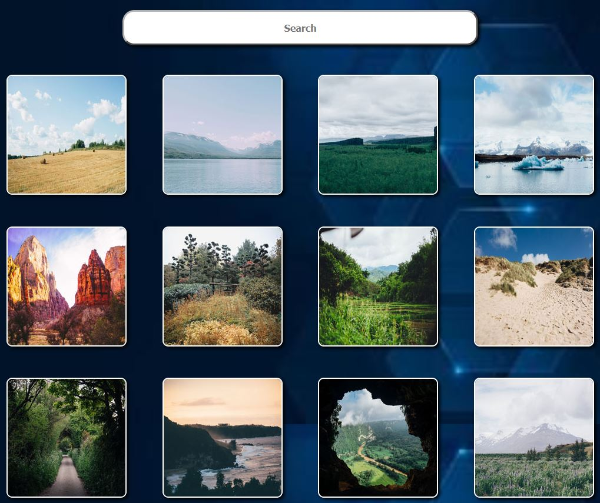

# treehouse-photogallery-project-5

## Description

This webpage was created to test grid css layout. This project contains HTML, a lightbox javaScript plugin and a search bar javaScript plugin. This webpage was a Team Treehouse front end techdegree project for module 5. It was designed to test students skills of utilizing the grid layout in CSS while keeping a responsive webpage.

## Installation

N/A

## Usage

To use this webpage you can open the Chrome DevTools by pressing Command+Option+I (macOS) or Control+Shift+I (Windows), then clicking the responsive layout icon. You can then grab the edge of the page and increase or decrease the screensize to view how the grid layout adjusts the images. Furthermore you can click the images and scroll through them using the arrows on the sides. Lastly you can use the search bar at the top of the page to search an image -- and you will see as you type images that dont match the search will start to dissapear from the page.

## Credits

https://github.com/CoreyDC/treehouse-photo-gallery-project-5

https://coreydc.github.io/treehouse-photo-gallery-project-5/